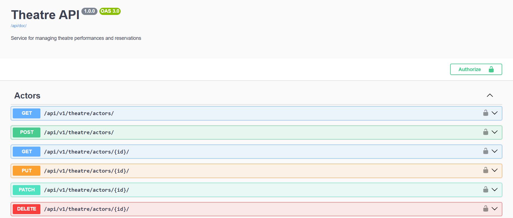
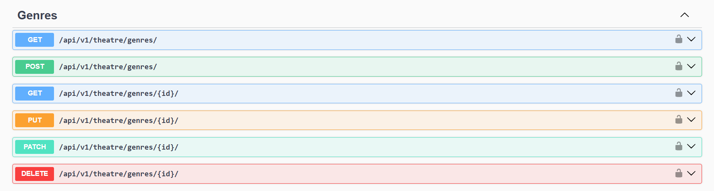
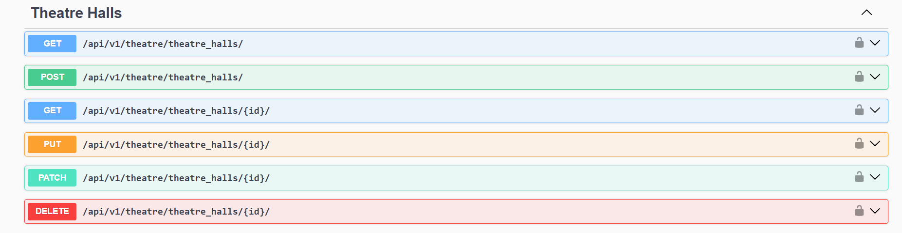
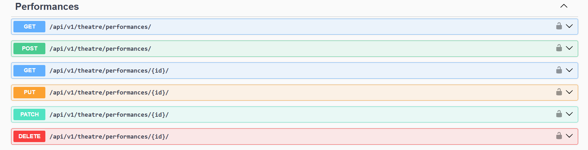
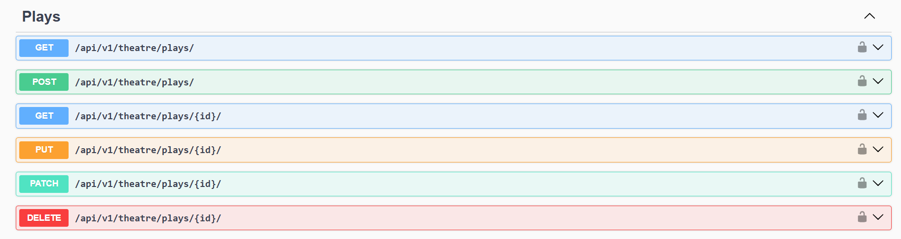
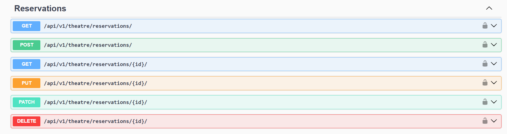
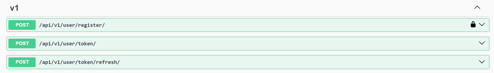

# Theatre API

REST API service for theatre management built with Django REST Framework.

## Features

- JWT Authentication
- User registration
- Admin panel `/admin/`
- API documentation `/api/doc/swagger/`
- Managing plays, genres, actors
- Managing theater halls
- Creating performances
- Ticket reservation system
- Filtering, searching, ordering
- Pagination


## Tech Stack

- Python
- Django
- Django REST Framework
- PostgreSQL
- Docker and Docker Compose


## Run with docker

Docker should be installed

#### Clone repository
```bash
git clone https://github.com/B0hdanR/theatre-api.git
cd theatre-api
```
#### Environment Variables

Create .env file based on .env.sample

#### Run project
```bash
docker-compose up --build
```

#### Docker image is available on Docker Hub:
https://hub.docker.com/r/bytden/theatre-api

To use Docker Hub image, update docker-compose.yml:
```
app:
  image: bytden/theatre-api
```


### Create superuser

```bash
docker ps
docker exec -it <app_container_name> sh
python manage.py createsuperuser
```

### Run tests

```bash
docker-compose run app sh -c "pytest"
```

## Run locally (without Docker)

```bash
git clone https://github.com/B0hdanR/theatre-api.git
cd theatre-api

python -m venv venv
source venv/bin/activate # or venv\Scripts\activate (Windows)

pip install -r requirements.txt

python manage.py migrate
python manage.py runserver
```

### After running, open:
http://127.0.0.1:8000/api/doc/swagger/

## Authentication

Register: `api/v1/user/register/`

Get token: `api/v1/user/token/`

Refresh token: `api/v1/user/token/refresh/`

## API Documentation
Swagger available at: `/api/doc/swagger`

## Access

- Swagger: http://127.0.0.1:8000/api/doc/swagger/
- Admin: http://127.0.0.1:8000/admin/

## Environment Variables
Example `.env`
```
# database
POSTGRES_DB=postgres
POSTGRES_USER=postgres
POSTGRES_PASSWORD=postgres
POSTGRES_HOST=db
POSTGRES_PORT=5432
# django settings
DJANGO_SECRET_KEY=<secret_key>
DJANGO_SETTINGS_MODULE=theatre_service.settings.dev
DJANGO_ALLOWED_HOSTS=localhost 127.0.0.1
```

## Settings
Project uses multiple settings:
- `dev` - Local development (SQLite, DEBUG=True)
- `prod` - Docker/production (PostgreSQL, DEBUG=False)
- `testing` - for running tests

Set in `.env`:
```
DJANGO_SETTINGS_MODULE=theatre_service.settings.dev
```


## Screenshots
### Swagger








## Database Structure

